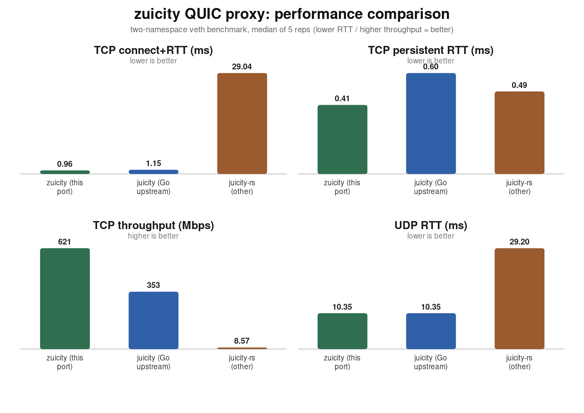

# zuicity

<p align="left">
    
    
    
    
    
</p>

**_zuicity_** is a high-performance, memory-lean QUIC proxy. It is a Rust port,
built upon and highly inspired by the upstream
[juicity](https://github.com/juicity/juicity) project.

It re-implements the juicity protocol on top of [quinn](https://github.com/quinn-rs/quinn)
and [tokio](https://github.com/tokio-rs/tokio), keeping byte-for-byte wire and
authentication compatibility with the upstream Go server and client, while
roughly doubling its TCP throughput and using close to half its memory. The port
is validated not only on a loopback test bench but over real cross-host network
paths and against a live, public Go juicity server on the Internet.

As a drop-in replacement for the upstream client and server, zuicity speaks
the same `run -c <config.json>` interface and the same config schema, so existing
juicity deployments interoperate with it unchanged.

## Highlights

- **Faster.** ~1.8x the TCP throughput of upstream Go juicity, with lower
  fresh-connect and persistent round-trip latency, on an identical real
  cross-host benchmark.
- **Leaner.** About a third of the server resident memory of upstream Go juicity
  on a real WAN server (~13 MB vs ~37 MB), with no leak: resident memory plateaus
  under load and freezes flat when idle.
- **Reliable.** Release builds keep UDP GSO opt-in for path safety on hostile
  egresses (veth, tun/VPN, virtio, many cloud NICs), while GRO remains
  receive-only and wire-invisible; the cross-host suite passes over IPv4, IPv6,
  and a 6-scenario comprehensive matrix.
- **Compatible.** Verified live against a real upstream Go juicity **v0.5.0**
  server over the public Internet, including full system-root TLS validation.

## Benchmarks

Two-namespace `veth` benchmark (real IP stack and real QUIC, not loopback),
median of 5 repetitions per implementation. Lower is better for latency and
memory; higher is better for throughput.

| Metric | zuicity (this port) | juicity (Go) | juicity-rs (other) |
|---|---:|---:|---:|
| TCP fresh connect+RTT (ms) | **0.96** | 1.15 | 29.0 |
| TCP persistent RTT (ms) | **0.41** | 0.60 | 0.49 |
| TCP throughput (Mbps) | **621** | 353 | 8.6 |
| UDP RTT (ms) | **10.35** | 10.35 | 29.2 |



### Real-Internet WAN (US client to KR server, ~129 ms RTT)

A live cross-region benchmark over the public Internet between a US client and a
KR server (~129 ms base round-trip), average of 5 runs against an upstream Go
juicity **v0.5.0** server on the same endpoint. This is the latency-dominated
case where per-connection handshake cost and congestion control matter most.

| Metric | zuicity (this port) | juicity (Go) |
|---|---:|---:|
| TCP fresh connect+RTT (ms) | **132.6** | 133.5 |
| TCP persistent RTT (ms) | 129.0 | **128.9** |
| TCP throughput (Mbps) | **49.4** | 49.0 |
| UDP RTT (ms) | **128.7** | 129.0 |
| Server peak RSS (MB) | **13.2** | 36.6 |

Over the real WAN, zuicity matches or beats Go on fresh connect, throughput, and
UDP latency, while using about **64% less server memory** (~13 MB vs ~37 MB). The
test fleet is two US servers and one KR server.

Full data, the spreadsheet, and a one-command reproduction harness live in
[`docs/benchmarks`](./docs/benchmarks) and
[`scripts/benchmark`](./scripts/benchmark):

- `docs/benchmarks/benchmark-comparison.xlsx` - the comparison spreadsheet (performance + memory)
- `docs/benchmarks/benchmark-chart.svg` / `.png` - the chart
- `scripts/benchmark/run-comparison.sh` - reproduce the whole comparison

> The `veth` numbers are from a single-host bench for relative comparison under
> identical kernel/host conditions; the WAN numbers are from a real cross-region
> Internet path. Absolute values differ on physical NICs and across networks.

## Performance

The throughput advantage comes from a sequence of evidence-backed changes, each
A/B-tested and gated on cross-host correctness:

- A shared, reused QUIC connection across forwarded and mixed SOCKS5/HTTP
  streams (mirroring the Go dialer), collapsing the per-connection handshake cost
  - the change that closes the fresh-connect latency gap on real WAN paths.
- BBR congestion control wired into the QUIC transport, matching upstream's
  `congestion_control=bbr` instead of silently falling back to CUBIC.
- Concurrent per-stream relay on the server (Go's goroutine-per-stream model).
- 64 KiB relay buffers and `TCP_NODELAY` on local and target sockets.
- Optional adaptive Linux UDP GSO on send and GRO on receive.
- A non-blocking UDP send path that never blocks a runtime worker.

## Memory usage

zuicity is deliberately memory-lean and is profiled for leaks, not just peak
size:

- On a real WAN server, peak server RSS is about **13 MB**, versus ~37 MB for
  upstream Go juicity - roughly 64% less server memory.
- No leak: under sustained connection churn, resident memory plateaus and then
  freezes flat the moment traffic stops.
- The QUIC flow-control windows that drive throughput are credit ceilings, not
  upfront allocations, so they cost almost nothing at idle.
- The proxy runtime caps its tokio worker threads, so it does not pay a
  per-core worker stack and allocator arena on large hosts. Override with
  `ZUICITY_WORKER_THREADS` (0 = tokio default).
- The shipped systemd units tune the allocator (`MALLOC_ARENA_MAX`,
  `MALLOC_TRIM_THRESHOLD_`) to return freed pages promptly, with no throughput
  cost.

## Reliability

- **Adaptive GSO/GRO with fallback.** UDP segmentation offload is off by default
  for release safety. `ZUICITY_ENABLE_GSO=1` opts in on Linux, and eligible
  post-handshake bulk packets fall back, in the same send call, to plain
  datagrams on `EINVAL`/`EIO`, per destination. QUIC handshake packets are never
  segmented, so the handshake always completes even on GSO-hostile paths.
- **Connection-loss handling.** A peer that disappears is treated as a clean
  connection close rather than a hard error.
- **Cross-host validation.** The two-namespace runtime, 6-scenario
  comprehensive, and IPv6 suites pass with default-safe send behavior and with
  opt-in GSO/GRO engaged.

## Compatibility

zuicity is a drop-in replacement for upstream juicity:

- Same `run -c <config.json>` CLI for both client and server.
- Same config schema (`listen`, `server`, `uuid`, `password`, `sni`,
  `allow_insecure`, `pinned_certchain_sha256`, `forward`, `congestion_control`, ...).
- Same QUIC/TLS 1.3 wire protocol and authentication, so a zuicity client
  interoperates with a Go server and vice versa.
- When `allow_insecure` is false and no certificate is pinned, the client
  validates the server certificate against the system root store, exactly like
  the Go client.

This is verified live: the zuicity client connects to a real upstream Go
juicity **v0.5.0** server on the public Internet, completes the QUIC handshake
and authentication, validates the server's real certificate against system
roots, and relays HTTPS traffic end-to-end.

## Getting Started

Build the client and server:

```bash
cargo build --release --bin zuicity-client --bin zuicity-server
```

Run the server with a config:

```bash
./target/release/zuicity-server run -c server.json
```

Run the client with a config:

```bash
./target/release/zuicity-client run -c client.json
```

A minimal client `config.json` (local SOCKS5/HTTP proxy that tunnels to a
juicity server):

```json
{
  "listen": "127.0.0.1:1080",
  "server": "your.server:port",
  "uuid": "your-uuid",
  "password": "your-password",
  "sni": "your.server.sni",
  "congestion_control": "bbr"
}
```

## Reproduce the benchmark

```bash
sudo scripts/benchmark/run-comparison.sh \
  --rust-dir  <dir with zuicity-client/zuicity-server> \
  --go-dir    <dir> \
  --other-dir <dir> \
  --reps 5 --iters 60
```

See [`scripts/benchmark/README.md`](./scripts/benchmark/README.md) for the full
build/fetch/run/chart workflow.

## Related projects

- [juicity-rs](https://github.com/juicity/juicity-rs) - a separate Rust reimplementation.
- [quinn](https://github.com/quinn-rs/quinn) - the QUIC implementation this port builds on.

## License

Licensed under AGPL-3.0-only.
