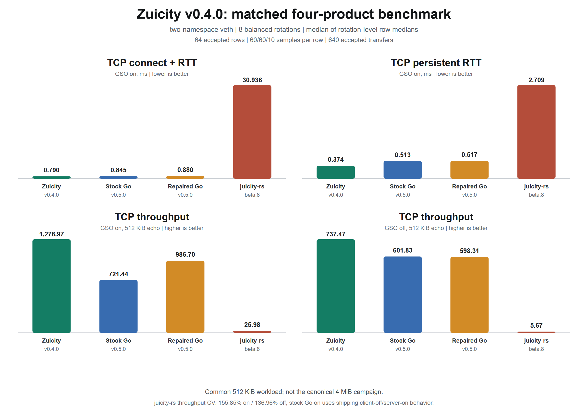

# zuicity

<p align="left">
    
    
    
    
    
</p>

**_zuicity_** is a high-performance, memory-lean QUIC proxy. It is a Rust port,
built upon and highly inspired by the upstream
[juicity](https://github.com/juicity/juicity) project.

It re-implements the juicity protocol on top of [quinn](https://github.com/quinn-rs/quinn)
and [tokio](https://github.com/tokio-rs/tokio), keeping byte-for-byte wire and
authentication compatibility with the upstream Go server and client. In the
latest matched local-veth campaign, v0.4.0 delivered 1.77x stock Go throughput
with 56% less combined peak process memory. The port is validated not only on a
local test bench but over real cross-host network paths and against a live,
public Go juicity server on the Internet.

As a drop-in replacement for the upstream client and server, zuicity speaks
the same `run -c <config.json>` interface and the same config schema, so existing
juicity deployments interoperate with it unchanged.

## Highlights

- **Faster.** In the matched GSO-on campaign, v0.4.0 reached 1278.97 Mbps:
  74.03% higher paired throughput than stock Go v0.5.0 and 19.69% higher than
  repaired full-GSO Go v0.5.0.
- **Leaner.** Combined peak process memory was 16,974 KiB versus 38,464 KiB for
  stock Go in the matched campaign. On a historical real-WAN server, zuicity
  used ~13 MB versus ~37 MB for Go, with no observed leak.
- **Reliable.** Release builds keep UDP GSO opt-in for path safety on hostile
  egresses (veth, tun/VPN, virtio, many cloud NICs), while GRO remains
  receive-only and wire-invisible; the cross-host suite passes over IPv4, IPv6,
  and a 6-scenario comprehensive matrix.
- **Compatible.** Verified live against a real upstream Go juicity **v0.5.0**
  server over the public Internet, including full system-root TLS validation.

## Benchmarks

This matched campaign used two fresh Linux network namespaces joined by a
`veth` pair, real kernel IP and QUIC stacks, and one complete eight-treatment
Williams square. It completed eight balanced rotations, 64 accepted rows, and
640 accepted throughput transfers. Each row contained 60 fresh-connect RTT,
60 persistent RTT, and 10 throughput samples. Values are medians of the eight
accepted rotation-level row medians.

| Implementation | Effective GSO | Throughput (Mbps) | Connect RTT (ms) | Persistent RTT (ms) | Combined HWM (KiB) |
|---|---|---:|---:|---:|---:|
| **Zuicity v0.4.0** | full on | **1278.97** | **0.790** | **0.374** | **16,974** |
| Stock Go v0.5.0 | shipping client-off/server-on | 721.44 | 0.845 | 0.513 | 38,464 |
| Repaired Go v0.5.0 | full on | 986.70 | 0.880 | 0.517 | 38,528 |
| Latest juicity-rs | Quinn default on | 25.98 | 30.936 | 2.709 | 42,598 |
| **Zuicity v0.4.0** | native off | **737.47** | **0.890** | **0.403** | **16,652** |
| Stock Go v0.5.0 | native off | 601.83 | 0.929 | 0.517 | 38,396 |
| Repaired Go v0.5.0 | native off | 598.31 | 0.890 | 0.510 | 38,080 |
| Latest juicity-rs | externally controlled off | 5.67 | 28.906 | 1.732 | 29,086 |



Against stock Go, Zuicity's paired throughput change was +74.03% with GSO on
(7-1, exact one-sided sign-test p=0.0352) and +26.35% with GSO off (5-3,
p=0.3633). Against repaired Go it was +19.69% on (7-1, p=0.0352) and +18.83%
off (6-2, p=0.1445). With eight rotations, the GSO-on Go comparisons met the
0.05 threshold; the GSO-off comparisons did not.

The common throughput payload was reduced to 512 KiB for every implementation
because latest `juicity-rs` timed out on one 4 MiB transfer after 120 seconds,
despite 141 successful `UDP_SEGMENT` sends. This is therefore a complete,
balanced common-workload comparison, not the canonical 4 MiB campaign. All
eight GSO probes passed. One `juicity-rs` GSO-on warmup timed out and was
retained; its retry passed. Its throughput was also highly variable, with row
CVs of 155.85% on and 136.96% off. Upstream HEAD and the latest release were
both `v0.1.0.beta.8` at commit `33caa0f`; the official x86-64-v3 binaries were
used.

### Historical Real-Internet WAN (US client to KR server, ~129 ms RTT)

A live cross-region benchmark over the public Internet between a US client and a
KR server (~129 ms base round-trip), average of 5 runs against an upstream Go
juicity **v0.5.0** server on the same endpoint. This is the latency-dominated
case where per-connection handshake cost and congestion control matter most.

| Metric | zuicity (this port) | juicity (Go) |
|---|---:|---:|
| TCP fresh connect+RTT (ms) | **132.6** | 133.5 |
| TCP persistent RTT (ms) | 129.0 | **128.9** |
| TCP throughput (Mbps) | **49.4** | 49.0 |
| UDP RTT (ms) | **128.7** | 129.0 |
| Server peak RSS (MB) | **13.2** | 36.6 |

Over the real WAN, zuicity matches or beats Go on fresh connect, throughput, and
UDP latency, while using about **64% less server memory** (~13 MB vs ~37 MB). The
test fleet is two US servers and one KR server.

The qualified four-product result, chart sources, historical data, and current
manifest-driven release harness live in
[`docs/benchmarks`](./docs/benchmarks) and
[`scripts/benchmark`](./scripts/benchmark):

- `docs/benchmarks/v0.4.0-four-product-512k.md` - methodology, hashes, comparisons, and limitations
- `docs/benchmarks/benchmark-chart.svg` / `.png` / `.md` - the current matched-campaign chart and table
- `scripts/benchmark/run-comparison.sh` - run a hash-pinned TCP GSO campaign
- `scripts/benchmark/tcp-gso-v040-go-jrs.example.json` - exact four-product artifacts and mode controls
- `docs/benchmarks/benchmark-comparison.xlsx`, `results.jsonl`, and `memory.jsonl` - retired historical data

> The `veth` numbers are from a single-host bench for relative comparison under
> identical kernel/host conditions; the WAN numbers are from a real cross-region
> Internet path. Absolute values differ on physical NICs and across networks.

## Performance

The throughput advantage comes from a sequence of evidence-backed changes, each
A/B-tested and gated on cross-host correctness:

- A shared, reused QUIC connection across forwarded and mixed SOCKS5/HTTP
  streams (mirroring the Go dialer), collapsing the per-connection handshake cost
  - the change that closes the fresh-connect latency gap on real WAN paths.
- BBR congestion control wired into the QUIC transport, matching upstream's
  `congestion_control=bbr` instead of silently falling back to CUBIC.
- Concurrent per-stream relay on the server (Go's goroutine-per-stream model).
- 64 KiB relay buffers and `TCP_NODELAY` on local and target sockets.
- Optional adaptive Linux UDP GSO on send and GRO on receive.
- A non-blocking UDP send path that never blocks a runtime worker.

## Memory usage

zuicity is deliberately memory-lean and is profiled for leaks, not just peak
size:

- On a real WAN server, peak server RSS is about **13 MB**, versus ~37 MB for
  upstream Go juicity - roughly 64% less server memory.
- No leak: under sustained connection churn, resident memory plateaus and then
  freezes flat the moment traffic stops.
- The QUIC flow-control windows that drive throughput are credit ceilings, not
  upfront allocations, so they cost almost nothing at idle.
- The proxy runtime caps its tokio worker threads, so it does not pay a
  per-core worker stack and allocator arena on large hosts. Override with
  `ZUICITY_WORKER_THREADS` (0 = tokio default).
- The shipped systemd units tune the allocator (`MALLOC_ARENA_MAX`,
  `MALLOC_TRIM_THRESHOLD_`) to return freed pages promptly, with no throughput
  cost.

## Reliability

- **Adaptive GSO/GRO with fallback.** UDP segmentation offload is off by default
  for release safety. `ZUICITY_ENABLE_GSO=1` opts in on Linux, and eligible
  post-handshake bulk packets fall back, in the same send call, to plain
  datagrams on `EINVAL`/`EIO`, per destination. QUIC handshake packets are never
  segmented, so the handshake always completes even on GSO-hostile paths.
- **Connection-loss handling.** A peer that disappears is treated as a clean
  connection close rather than a hard error.
- **Cross-host validation.** The two-namespace runtime, 6-scenario
  comprehensive, and IPv6 suites pass with default-safe send behavior and with
  opt-in GSO/GRO engaged.

## Compatibility

zuicity is a drop-in replacement for upstream juicity:

- Same `run -c <config.json>` CLI for both client and server.
- Same config schema (`listen`, `server`, `uuid`, `password`, `sni`,
  `allow_insecure`, `pinned_certchain_sha256`, `forward`, `congestion_control`, ...).
- Same QUIC/TLS 1.3 wire protocol and authentication, so a zuicity client
  interoperates with a Go server and vice versa.
- When `allow_insecure` is false and no certificate is pinned, the client
  validates the server certificate against the system root store, exactly like
  the Go client.

This is verified live: the zuicity client connects to a real upstream Go
juicity **v0.5.0** server on the public Internet, completes the QUIC handshake
and authentication, validates the server's real certificate against system
roots, and relays HTTPS traffic end-to-end.

## Getting Started

Build the client and server:

```bash
cargo build --release --bin zuicity-client --bin zuicity-server
```

Run the server with a config:

```bash
./target/release/zuicity-server run -c server.json
```

Run the client with a config:

```bash
./target/release/zuicity-client run -c client.json
```

A minimal client `config.json` (local SOCKS5/HTTP proxy that tunnels to a
juicity server):

```json
{
  "listen": "127.0.0.1:1080",
  "server": "your.server:port",
  "uuid": "your-uuid",
  "password": "your-password",
  "sni": "your.server.sni",
  "congestion_control": "bbr"
}
```

## Reproduce the benchmark

```bash
export CANDIDATE_BIN_DIR=<candidate build directory>
export GO_STOCK_BIN_DIR=<stock Go v0.5.0 directory>
export GO_REPAIRED_BIN_DIR=<repaired Go directory>
export JUICITY_RS_BIN_DIR=<official juicity-rs x86-64-v3 directory>
export JUICITY_RS_GSO_SHIM=<hash-pinned GSO-off preload path>

sudo --preserve-env=CANDIDATE_BIN_DIR,GO_STOCK_BIN_DIR,GO_REPAIRED_BIN_DIR,JUICITY_RS_BIN_DIR,JUICITY_RS_GSO_SHIM \
  scripts/benchmark/run-comparison.sh \
  --manifest scripts/benchmark/tcp-gso-v040-go-jrs.example.json \
  --out-dir benchmark-results/v040-go-jrs-common-512k \
  --profile standard \
  --rtt-samples 60 \
  --throughput-samples 10 \
  --throughput-bytes 524288 \
  --warmup-transfers 2 \
  --max-row-attempts 5 \
  --server-cpus <reviewed server CPUs> \
  --client-cpus <reviewed client CPUs> \
  --driver-cpus <reviewed driver CPU> \
  --echo-cpus <reviewed echo CPU>
```

If the local `sudo` policy disallows `--preserve-env`, pass the paths through an
approved root environment instead. See
[`scripts/benchmark/README.md`](./scripts/benchmark/README.md) for hash
validation, profiles, GSO probes, statistical rules, output layout, and the
historical `h156` versus released-v0.3.0 provenance correction.

## Related projects

- [juicity-rs](https://github.com/juicity/juicity-rs) - a separate Rust reimplementation.
- [quinn](https://github.com/quinn-rs/quinn) - the QUIC implementation this port builds on.

## License

Licensed under AGPL-3.0-only.
